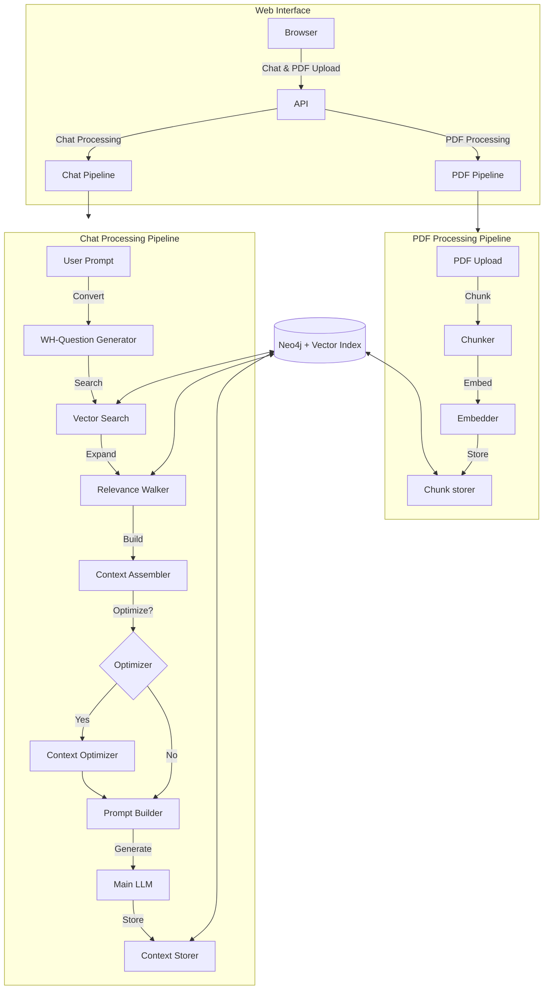

# GraphLTM - Graph-Based Long-Term Memory Engine
> _Turn any LLM into a self-extending knowledge agent powered by a graph-structured memory - complete with PDF-to-graph ingestion, budget-aware optimisation, and dual-engine orchestration._

[](LICENSE)
[](.python-version)


---

## Table of Contents
1. [Key Features](#key-features)
2. [Subsystems](#subsystems)
3. [Graph Schema & Node Types](#graph-schema--node-types)
4. [Retrieval, Optimisation & STM](#retrieval-optimisation--stm)
5. [PDF Uploader & Knowledge Nodes](#pdf-uploader--knowledge-nodes)
6. [Architecture Overview](#architecture-overview)
7. [Quick Start](#quick-start)
8. [Configuration](#configuration)
9. [API Reference](#api-reference)
10. [Testing & Quality](#testing--quality)
11. [Roadmap](#roadmap)
12. [Contributing](#contributing)
13. [License](#license)
14. [Citation](#citation)

---

## Key Features

The GraphLTM project showcases advanced skills in Natural Language Processing, Large Language Models, Graph Databases, and scalable system design.

| Category | Highlights | Skills Demonstrated |
|----------|------------|---------------------|
| **Memory Graph** | Four node types (*Knowledge*, *Memory*, *Synthesis*, *Concept*) with typed edges. Concept nodes store a **mixed** embedding blending parent meaning & key phrase (K*V-style). | Graph Database Design, Knowledge Representation, Semantic Embedding, Data Modeling |
| **PDF -> Knowledge** | Web GUI to upload PDFs and convert into *Knowledge* nodes. Real-time progress via WebSockets. Source metadata (`source_name`, `source_file`, `page_num`, `chunk_id`) is stored as properties on each `Knowledge` node. | Full-Stack Web Development (Flask, Socket.IO), Document Processing (PDF Parsing, Text Extraction), Data Ingestion Pipelines |
| **Retrieval Pipeline** | Prompts re-written as **WH-questions** before vector search. Relevance walk expands hits through `RELATES_TO` & `TAGS` edges. Supports **hybrid RAG**: Knowledge + Memories + Synthesis. | Advanced RAG Techniques, NLP (Question Generation), Graph Traversal Algorithms, Information Retrieval, Vector Search |
| **Context Optimisation** | Optional **optimiser stage** condenses retrieved nodes into one coherent assistant message, driven by a *Token Budget Calculator* ensuring context fits the window. | LLM Context Management, Token Optimization, Prompt Engineering, Resource Management |
| **Signal Gating & Dedup** | LLM scores *info* & *emotion*, skips low-value or duplicate memories. | LLM Evaluation, Memory Management, Data Filtering, Autonomous Agents |
| **Autonomous Synthesis** | Cluster drift triggers creation of summarising *Synthesis* nodes. | Unsupervised Learning (Conceptual Grouping), Knowledge Summarization, Autonomous System Design |
| **Dual-Engine Strategy** | **Main LLM** (GPT-4o etc.) crafts optimiser & user replies, while **Aux LLM** (local/cheaper) handles WH-question generation, scoring, concept extraction, synthesis. | LLM Orchestration, API Integration, Cost Optimization, Task-Specific Model Utilization |
| **Configurable Modes** | Toggle *read-only* vs *read+write*. Enable/disable optimiser & PDF ingestion. | System Configuration, Modular Design, User Control, Flexibility |
| **STM Co-Pilot** | Fast in-process short-term buffer holds last *n* conversational turns. | Conversational AI, State Management, Efficient Data Buffering |

---

## Subsystems

GraphLTM ships as a **unified web service** providing two main interfaces:

| Subsystem |  Responsibilities | Typical Lifespan |
|-----------|------------------|------------------|
| **Chat Interface** | Handles user chat interactions, context retrieval, LLM orchestration, and memory write. | Long-running daemon |
| **PDF Management Interface** |  Provides a web GUI for PDF ingestion, including chunking, embedding, storing Knowledge nodes, and managing sources. | Long-running daemon |

This unified service writes to the **same Neo4j + vector index**, so newly ingested knowledge becomes queryable by the Chat Engine in real time.

---

## Graph Schema & Node Types

| Label | Origin | Description | Key Properties |
|-------|--------|-------------|---------------|
| **Knowledge** | PDF / external | Cleaned chunk of a source doc. | `source_name`, `source_file`, `page_num`, `chunk_id`, `text`, `embedding` |
| **Memory** | Chat | Persisted user <-> assistant turn. | `prompt`, `response`, `title`, `embedding` |
| **Synthesis** | Auto | Summary representing a cluster. | `synthesis_text`, `created_at`, `embedding` |
| **Concept** | Extraction | Key phrase node; embedding = `α·parent + (1-α)·phrase`. | `phrase`, `embedding`, `alpha` |

### Edges

| Type | Source -> Target | Meaning |
|------|-----------------|---------|
| `RELATES_TO` | Any <-> Any | Semantic similarity / topical link |
| `TAGS` | Concept -> (Memory | Knowledge | Synthesis) | Concept phrase tags a node |
| `NEXT_CHUNK` | Knowledge -> Knowledge | Sequential order of PDF chunks |
| `SYNTHESIZED_BY` | Memory -> Synthesis | Memory compressed into synthesis node |
| `EXTENDS` | Synthesis <-> Synthesis | Evolution across clusters |

-----

## Retrieval, Optimisation & STM

```text
User Prompt
   │
   ▼
WH-Question Generator  (Aux LLM)
   │
   ▼
Vector Search (Neo4j)  ➜ returns Knowledge + Memory + Synthesis nodes
   │  top-k nodes
   ▼
Relevance Plan Walker  (heuristic walk + Concept boost)
   │  ranked nodes
   ▼
Context Assembler  (Token-Budget)
   • Adds nodes until budget cap
   ▼
Optional Optimiser  (Main LLM)
   • Condenses list into 1 coherent assistant message
   ▼
Prompt Builder
   • System prompt + (optimised context OR raw list) + STM buffer
   ▼
Main LLM -> Assistant Reply
   ▼
Context Storer  (Aux LLM) -> GraphDB
```

## PDF Uploader & Knowledge Nodes

* Visit the web interface at `http://localhost:<port>` (default port is configured in config.py)
* The interface provides two main features:
  - Chat interface for interacting with the LLM
  - PDF management interface for uploading and managing knowledge sources
* Each document is chunked, embedded, and stored as `Knowledge` nodes with source metadata as properties.
* GUI displays ingestion progress live via WebSockets.


---

## Architecture Overview



## Quick Start

```bash
git clone https://github.com/bazilicum/GraphLTM.git
cd GraphLTM
cp .env.example .env   # add API keys

docker compose up -d   # Neo4j, Flask API, optional LocalAI

# Access the web interface
open http://localhost:<port>  # port configured in config.py
```

### Configuration

| Setting | Default | Role |
|---------|---------|------|
| `web_server.port` | `5000` | Web server port |
| `memory.long_term.write.enabled` | `True` | Persist new memories |
| `memory.optimize_message_list.enabled` | `True` | Enable optimiser |
| `memory.token_budget.window` | `8192` | Context window tokens |
| `ingestion.pdf.enabled` | `True` | Toggle PDF pipeline |
| `llm.main_chat_loop.provider` | `openai` | Main LLM |
| `llm.aux.provider` | `openai` | Aux LLM |


Full option matrix lives in **config.py**.


---


## Contributing

See **CONTRIBUTING.md** - PRs welcome!

---

## License

MIT

---

## Citation


```bibtex
@software{graphltm2025,
  author  = {Erez Azaria},
  title   = {GraphLTM: Graph-Based Long-Term Memory for LLMs},
  year    = {2025},
  version = {v0.1.0},
  url     = {[https://github.com/bazilicum/GraphLTM](https://github.com/bazilicum/GraphLTM)},
}   
```
